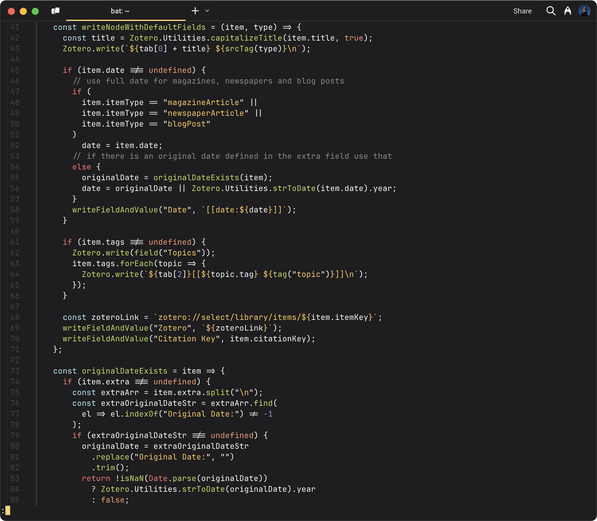

Filip, if you see this in time, I plan to change this private repo to public
on Monday, at which point I will remove you as a collaborator, but I wanted you
to have the chance to give it a quick look as it is derivative of your work, I
wanted you to have an opportunity to request or make any changes.

Best, Darren

# 0x96f theme for Bat

This is a port of the [0x96f theme for
Zed](https://github.com/filipjanevski/zed-theme) by
[@filipjanevski](https://github.com/filipjanevski) that I made primarily for use
with [Bat](https://github.com/sharkdp/bat), a "cat clone with syntax
highlighting and Git integration". I personally use 0x96f as my theme in
[Zed](https://zed.dev/) and [Warp](https://www.warp.dev/) (with some minor
alterations) and so I wanted to have the same colour scheme in Bat which I use
extensively. That said, it is a TextMate theme (as that's what Bat uses), and so
presumably is suitable for use with anything else which uses that format.
Suggestions for renaming the repo accordingly for better visibility would be
welcome.

The initial step to doing this was converting Filip's earlier
[0x96f theme for VS Code](https://github.com/filipjanevski/0x96f-vscode-theme) into TextMate
format using [@tobiastimm](https://github.com/tobiastimm)'s
[code-theme-converter](https://github.com/tobiastimm/code-theme-converter). However,
that resulted in a number of errors. I've addressed them as best I can and tried to update
any older colour choices to the ones found in the Zed theme. However, due to my complete lack
of familiarity with the TextMate theme format, I'm certain that improvements could be made.

## Screenshot

## Manual install

- Copy the `0x96f.tmTheme` file from this repo into `~/.config/bat/themes`.
- Run the command `bat cache --build`.
